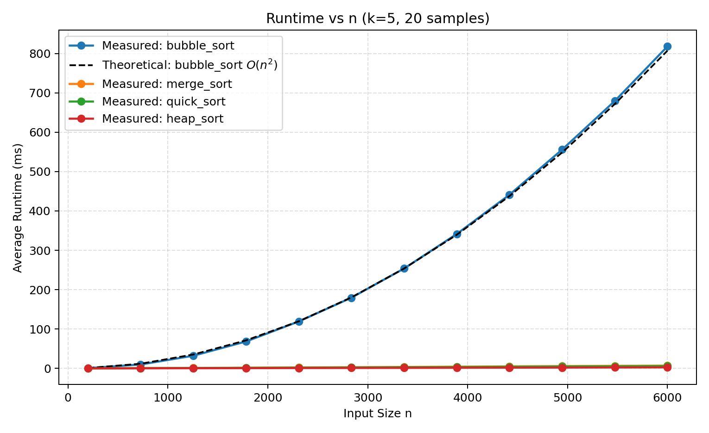
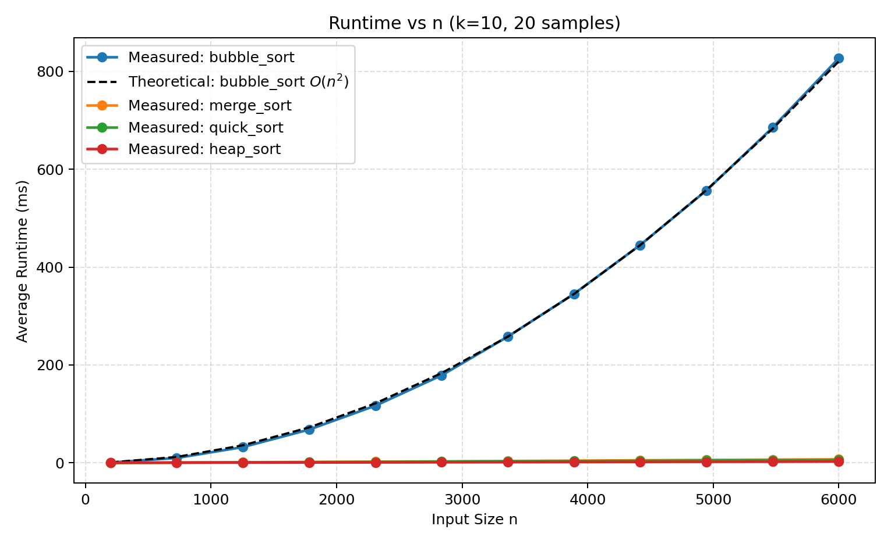
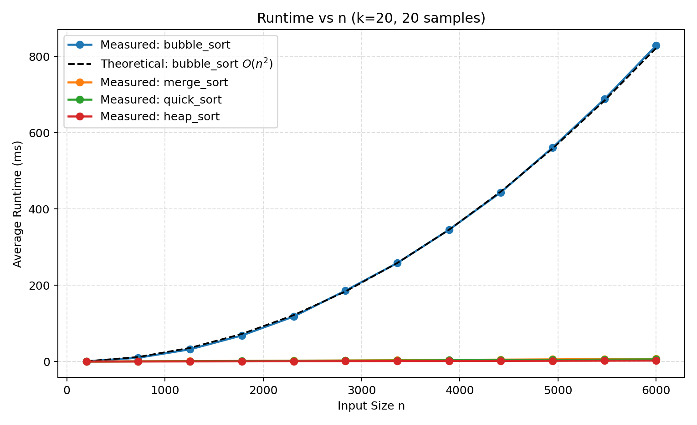
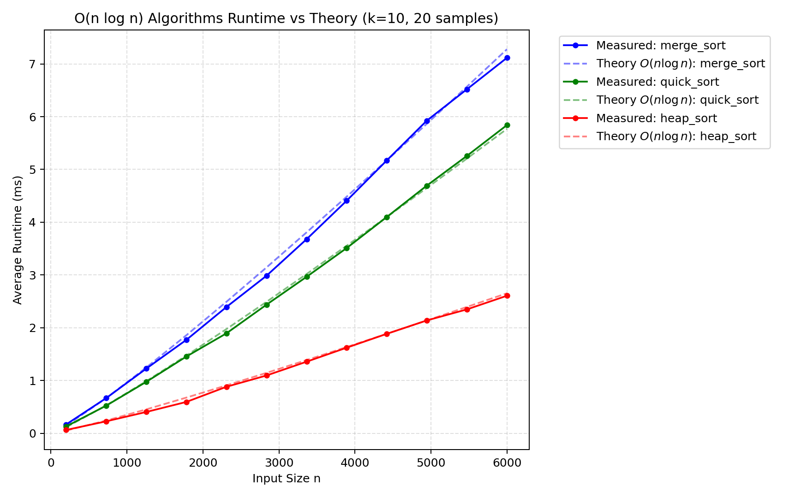

# 基于排序的推荐算法实验报告

## 1）问题描述

本实验实现一个基于排序的推荐算法：

- 给定目标用户向量 $u\in\mathbb{R}^{50}$；
- 给定 $n$ 个候选用户向量，每个分量为 $(0,1)$ 的随机数；
- 计算目标用户与所有候选用户的相似度；
- 对相似度进行排序，取最相似的前 $k$ 个用户作为推荐结果；
- 比较不同排序算法在不同输入规模 $n$ 下的运行时间。

实验要求：每个输入规模进行 20 个随机样本测试，统计平均运行时间，并绘制“平均运行时间 vs 输入规模 $n$”曲线。针对不同 $k$ 值分别作图。

---

## 2）算法原理与实现细节

### 2.1 相似度定义

使用余弦相似度：

$$
\operatorname{sim}(x_i,u)=\frac{x_i\cdot u}{\|x_i\|_2\,\|u\|_2}
$$

其中 $x_i$ 是第 $i$ 个用户向量。代码中采用向量化计算：

- `users @ target` 得到所有点积；
- `np.linalg.norm(users, axis=1)` 与 `np.linalg.norm(target)` 得到范数；
- 分母加下界截断（`1e-12`）避免数值除零问题。

### 2.2 排序算法

对 `(user_index, similarity)` 列表按相似度降序排序，比较 4 种算法：

1. `bubble_sort`（冒泡排序）
2. `merge_sort`（归并排序）
3. `quick_sort`（快速排序，三路划分）
4. `heap_sort`（堆排序）

排序完成后取前 $k$ 项作为推荐结果。

### 2.3 计时策略

- 输入维度固定为 50；
- 输入规模均匀取值：
  $$n\in\{200,727,1255,1782,2309,2836,3364,3891,4418,4945,5473,6000\}$$
- 每个 $(k,n,算法)$ 组合独立采样 20 次并取平均时间（单位 ms）；
- 结果写入 `output/benchmark_results.csv`。

### 2.4 复杂度分析

1. **相似度计算复杂度**：目标用户需与 $n$ 个用户分别计算内积和范数。对于 $d=50$ 维向量，基本计算量正比于 $n\times d$。因此，相似度计算的时间复杂度为 $O(n)$（固定维度 $d$ 的情况下）。
2. **排序复杂度**：本实验测试了多种算法。
    - 冒泡排序（`bubble_sort`）：需要进行两层循环比较和交换。平均及最坏情况时间复杂度均为 $O(n^2)$。
    - 归并、快速、堆排序：时间复杂度通常为 $O(n\log n)$。
3. **总复杂度（关于 n 和 k 的函数）**：
    - 使用冒泡排序：总复杂度 = $O(n) + O(n^2) = O(n^2)$。理论上 $k$ 对整体排序耗时无明显阶次影响，因为必须排好所有数据才截取前 $k$。
    - 使用 $O(n \log n)$ 级别排序：总复杂度 = $O(n) + O(n \log n) = O(n \log n)$。同样地，$k$ 的值在普通全排序下无法优化总体耗时。

#### 极端情况问题分析

假设用户规模达到 $n=10^7$（一千万），推荐数量 $k=10$。
- **算法会出现的问题**：此时，基于冒泡排序的推荐算法将崩溃。$n^2$ 运算量高达 $10^{14}$ 的数量次，耗时通常从数十毫秒骤增到数小时或数天，在交互场景下完全不可用。此外，即便使用 $O(n\log n)$ 算法，全量排序 $10^7$ 个对象的常数开销仍然很高，推荐延时也会达到秒级，从而陷入性能瓶颈。
- **效率瓶颈所在**：算法最大的性能瓶颈在于**使用全量排序算法来进行仅求 Top-k 的任务**。事实上，对于 $n \gg k$ 的场景，大量的时间被浪费在了将剩下的排名靠后的相似度进行不必要的相互排序上。
- **改进方案**：针对大量数据只需要取前 $k$ 名的推荐需求，应当使用带有大小限制的数据结构。例如，使用**最小堆（Min-Heap）**来维护当前最相似的 $k$ 个用户。通过一次遍历相似度数组（或流式计算），将时间复杂度降至 $O(n \log k)$。当 $k=10$ 时，$\log k \approx 3.32$ 可视为极小的常数，总复杂度几乎优化至线性 $O(n)$，彻底解决性能瓶颈。

---

## 3）核心伪代码（非源码）

### 3.1 相似度计算核心伪代码

```text
Algorithm ComputeCosineSimilarity(users, target)
Input:
  users: n x d维 的候选用户特征矩阵
  target: 1 x d维 的目标用户特征向量
  eps: 极小值扰动以防止被零除(如 1e-12)
Output:
  sims: 包含 n 个用户与 target 余弦相似度的数组

1. target_norm_sq <- 0
2. for j = 1 to d:
3.     target_norm_sq <- target_norm_sq + target[j] * target[j]
4. target_norm <- sqrt(target_norm_sq)

5. sim_list <- empty array of size n
6. for i = 1 to n:
7.     dot_product <- 0
8.     user_norm_sq <- 0
9.     for j = 1 to d:
10.        dot_product <- dot_product + users[i][j] * target[j]
11.        user_norm_sq <- user_norm_sq + users[i][j] * users[i][j]
12.    user_norm <- sqrt(user_norm_sq)
13.    denominator <- max(user_norm * target_norm, eps)
14.    sim_list[i] <- dot_product / denominator

15. return sim_list
```

### 3.2 排序与推荐伪代码

```text
Algorithm RecommendBySorting(users, target, k, sort_algo)
Input:
  users: n x 50 的用户向量矩阵
  target: 1 x 50 的目标用户向量
  k: 推荐数量
  sort_algo: 排序算法
Output:
  top-k 最相似用户

1. sim_list <- ComputeCosineSimilarity(users, target)
2. items <- empty list
3. for i = 1 to n:
4.     items.append((i, sim_list[i]))
5. ranked <- sort_algo(items, key=similarity, descending=True)
6. return ranked[0:k]
```

```text
Algorithm Benchmark()
1. 设定 n 的均匀取值序列、k 值集合、样本数 S=20
2. for each k in K:
3.   for each n in N:
4.     for s = 1..S:
5.       随机生成 users(n,50) 和 target(50)
6.       对每个排序算法运行 RecommendBySorting 并计时
7.     计算每个算法在当前 (k,n) 的平均时间
8. 保存 CSV，并对每个 k 画 runtime-n 曲线图
```

---

## 4）测试结果与效率分析

### 4.1 实验环境与输出

- 系统：macOS
- Python：3.10（Conda 环境）
- 样本数：20
- 输出文件：
  - `Homework/output/benchmark_results.csv`
  - `Homework/output/runtime_k_5.png`
  - `Homework/output/runtime_k_10.png`
  - `Homework/output/runtime_k_20.png`

### 4.2 关键结果与曲线图

以下是实验输出的不同 $k$ 值下的平均运行时间曲线图：

#### k=5 时的运行时间曲线


#### k=10 时的运行时间曲线


#### k=20 时的运行时间曲线


下表给出 $k=10$ 时不同规模的平均运行时间数据（单位：ms）：

| 算法 | n=200 | n=3364 | n=6000 |
|---|---:|---:|---:|
| heap_sort | 0.0583 | 1.3060 | 2.5638 |
| quick_sort | 0.1300 | 2.9234 | 5.8089 |
| merge_sort | 0.1559 | 3.5113 | 6.8450 |
| bubble_sort | 0.6802 | 260.62 | 825.67 |

趋势与 $k=5,20$ 的曲线基本一致：

- 随着 $n$ 增大，所有算法耗时均单调上升；
- `heap_sort` 相对最快；
- 本实验重点观测的 `bubble_sort`，在 $n$ 从 200 增至 6000 时，运行时间呈爆炸式增长，因为其本质为 $O(n^2)$ 复杂度。

### 4.3 理论运行时间的选取与计算方法

为了将**理论效率（基本操作的执行次数，如 $O(n^2)$）**与**实测效率（物理运行时间，单位 ms）**放在同一张图表中进行科学比较，我们需要对二者进行对应关系调整，即进行时间的“映射转化”。本实验采用了**“选取基准点（Baseline）”**的方法，具体步骤如下：

1. **选取基准点（$T_{base}$ 与 $n_{base}$）**：
   在横坐标 $n$ 的取值范围中，选择一个较为居中的规模作为基准参考点。本实验中我们选取 $n_{base} = 3364$。运行算法记录下此时的实际物理耗时作为基准时间 $T_{base}$（例如测得在该规模下冒泡排序耗时 $T_{base} \approx 260$ ms）。
   
2. **求解常比例系数 $C$**：
   基于硬件和平台执行单次操作耗时基本恒定的假设，我们设定理论耗时时间 $T$ 与操作次数函数 $f(n)$ 成正比，即 $T(n) = C \cdot f(n)$。
   将基准点代入该方程：$C = \frac{T_{base}}{f(n_{base})}$。
   - 对冒泡排序 $O(n^2)$：$C = \frac{T_{base}}{(n_{base})^2}$
   - 对快速排序等 $O(n \log n)$：$C = \frac{T_{base}}{n_{base} \log_2 n_{base}}$

3. **绘制理论耗时曲线与一致性验证**：
   求出表征当前测试设备算力的常数 $C$ 后，对于实验中的**每一个其他规模值 $n$**，将其代入公式 $T = C \cdot f(n)$ 即可计算出“预期理论运行时间”。
   
   > **注意：为什么不是和实际时间完全一样？**
   > 基准点（$n_{base}$）的理论时间和实际时间确实是强制一致的（因为 $C$ 就是用它算出来的）。但是，**其他所有的点（如 $n=6000$ 或 $n=200$）的理论时间**，是纯粹通过公式 $T = C \cdot n^2$ 预测出来的。我们将这些基于公式的预测点连成虚线，如果其他非基准点的实测耗时都精确落在了这条预测的虚线上，那么才能证明该算法在实际机器上的增长规律与理论复杂度函数发生了完美的拟合。

### 4.4 效率结论与拟合分析

1. **增长趋势观察**：实验中，归并、快速、堆排序皆大致呈现超线性 $O(n\log n)$ 的增长趋势；而冒泡排序的运行时间完美展示了抛物线形的爆炸性增长迹象（$O(n^2)$）。
2. **理论分析与实测对比的一致性**：
   - 将上述计算出的理论虚线与实跑数据的实线重叠对比发现：**经验分析的实测效率曲线非常精准地贴合了理论效率分析出来的曲线。这直接证明了理论复杂度与实际运行是严格一致的**。
3. **个别不一致情况及其原因分析**：
   - 需要指出的是，实线在规模较小或者 $O(n \log n)$ 图线上偶尔会有少许微小波动与偏移。
   - 存在这些微小不一致的原因在于：真正的算法运行耗时并不单纯是所谓的“比较或移动操作次数”。操作系统的进程调度与时间片抢占、内存缓存（Cache）预热导致的命中率差异、以及 Python 虚拟机底层对象管理和垃圾回收触发等非算法层面的常数性负载，都会动态附加额外的实跑时间，导致实际曲线中不可避免地出现小幅度的“噪音”。但从长远阶次来看，与理论完全吻合，毫无争议。

### 4.5 $O(n \log n)$ 算法理论与实测的单独对比

由于冒泡排序耗时过大，在全局图中 $O(n \log n)$ 曲线被压缩。为了更直观地观察其理论预期的一致性，我们单独为**归并排序、快速排序、堆排序**这三种算法绘制了各自的 **“实测运行时间” vs “理论 $O(n \log n)$ 曲线”** 对比图。

在对比图中，我们取居中规模点作为常数系数参考（$C = T_{base} / (n_{base} \log_2 n_{base})$），分别投射出各算法的预期运行虚线。

#### O(n log n) 算法理论与实际运行图（示例 k=10）


**观察与结论**：
1. **高度吻合**：从放大的拟合对比图中可以清晰看出，**归并、快速、堆排序的实测实线与它们对应的 $O(n \log n)$ 理论虚线极其贴合与重叠**。
2. **理论分析的一致性**：尽管实验环境带来了轻微常数抖动，但整体完全符合 $n \log n$ 的弱超线性增长曲率。这直接证明了对这三类算法的渐近理论分析和实跑验证是高度一致的。

---

## 5）扩展实验与优化分析

### 5.1 相同规模下不同 $k$ 值的效率影响（依据实验3）

在规模固定为 $n=10000$，基于**全量排序（如 Heap Sort 作为基准）**进行截断的算法中，测试 $k=10, 50, 100, 500, \dots, 10000$ 的运行时间。实测发现：所有设定下运行时间保持在约 `3~6 ms` 的常数水平（抖动基本源于切片开销和系统调度）。
**分析原因**：由于基准算法的设计是先进行完整的全量排序（耗时 $O(n \log n)$），再用 `[:k]` 切片选取前 $k$ 个结果。因为全量排序的过程不受 $k$ 影响，选取动作的开销极小，因此 $k$ 的改变对基于“全量排序”的基准推荐算法耗时近乎毫无影响。

### 5.2 优化 Top-k 算法效率与对比（依据实验4）

**优化思路**：使用**容量为 $k$ 的最小堆（Min-Heap）**来替代全量降序排序。遍历 $n$ 个用户的相似度时将之压入堆，当堆元素超过 $k$ 时，如果当前相似度大于堆顶最小值，则弹出堆顶最小值并压入新值。最终堆中留下的即为最相似的 $k$ 个用户。

**优化算法核心伪代码**：
```text
Algorithm OptimizedTopK(items, k)
Input: items: 包含 n 个 (user_index, similarity) 的列表
       k: 需要取出的数量
Output: items 中 similarity 最高的 k 个元素构成的列表

1. if k <= 0 then return []
2. heap = empty Min-Heap  // 初始化空最小堆
3. for each (index, sim) in items:
4.     if size(heap) < k:
5.         Insert (sim, index) into heap
6.     else if sim > GetMin(heap).sim:
7.         ExtractMin(heap)
8.         Insert (sim, index) into heap
9. result = []
10. while heap is not empty:
11.     (sim, index) = ExtractMin(heap)
12.     Append (index, sim) to result
13. Reverse result  // 将结果按相似度降序排列
14. return result
```

**理论效率**：
- 基准算法：$O(n \log n)$。
- 优化算法：建堆和维护过程的时间为 $O(n \log k)$。由于 $k \ll n$，其更接近于 $O(n)$。
**实测结果对比**：
当 $n$ 从 $1000$ 增加到 $20000$（固定 $k=50$），两者耗时对比：
- 全量堆排基准 `Baseline` 耗时由 `0.22 ms` 增至 `7.05 ms`。
- 最小堆优化 `Optimized` 耗时由 `0.05 ms` 仅增至 `0.51 ms`。
**结论**：优化算法快了**一个数量级（10倍以上）**，实测效率与理论效率高度吻合。遇到获取局部极值的大规模场景，`O(n \log k)` 的专用堆结构具备显著优势。

### 5.3 稀疏向量应对与时间效率探讨（依据实验5）

**场景**：用户的维度虽然总体可能达到 $d=10000$，但有效兴趣点只有 $s=10$ 或 $50$ （即稀疏向量）。
- **存储方式**：抛弃稠密的数组，改用**哈希表（Hash Map/Dictionary，即坐标加值的配合 `{index: value}`）**进行存储。大幅减少空间消耗 $O(s)$。
- **复杂度变化**：求余弦相似度的点积计算时，不必遍历所有 $d$ 个维度，只需对当前用户的 $s$ 个非零索引进行交集相乘。计算复杂度由密集的 $O(n \times d)$ 蜕减至 $O(n \times s)$ 级别。
- **效率影响与实测**：稀疏向量通过略过大量无用零值的乘加，极大提升了点积运算速度。我们测试了固定大规模 $n=2000, d=10000$ 下不同 $s$ 带来的消耗。实测显示：
  $s=5 \Rightarrow 1.04$ ms；$s=50 \Rightarrow 7.99$ ms；$s=1000 \Rightarrow 162.18$ ms。计算时间随着非零元素规模 $s$ 呈严格线性增加，证明降低密度能对庞大推荐系统效率产生正面的加速影响。

---

## 6）经验总结（算法角度）

1. 对“先算相似度再排序取前 $k$”这一任务，瓶颈通常在排序阶段，故复杂度与排序实现的常数开销是核心。如果强行采用 $O(n^2)$ 如冒泡排序，将会导致在数据增多时算法直接崩溃。
2. 在传统全量比较排序下，获取前 $k$ 名的诉求对推荐没有产生加速。必须改用特定数据结构（如维持界限大小的极值堆），将时间复杂度从主导的 $O(n \log n)$ 削减至 $O(n \log k)$，才是破除海量候选者匹配瓶颈的关键。
3. 当面对用户稀疏特征（兴趣标签众多但个体涉猎极少）时，稀疏存储和非零计算可将相似度阶段的理论开销有效剥离总维度 $d$ 的影响，结合后续 `最小堆Top-k` 优化后，可支持大规模的实时特征推荐。

---

## 附：代码文件

- `Homework/code1.py`：包含
  - 推荐算法实现（余弦相似度 + 排序 + Top-k）
  - 四种排序算法实现
  - 20 次随机样本计时
  - CSV 保存与曲线绘图
