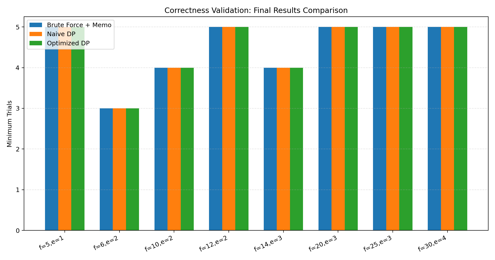
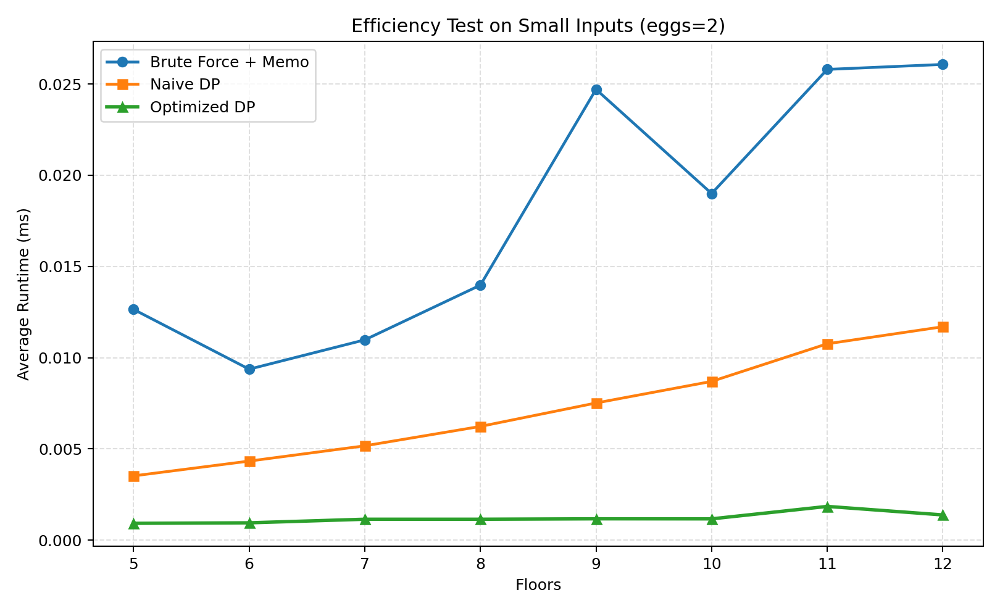
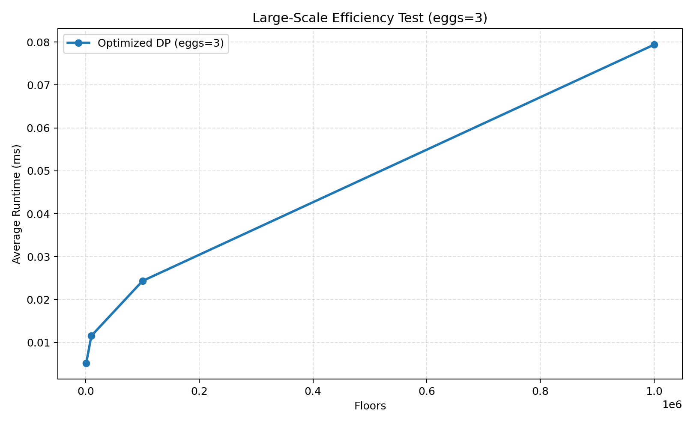
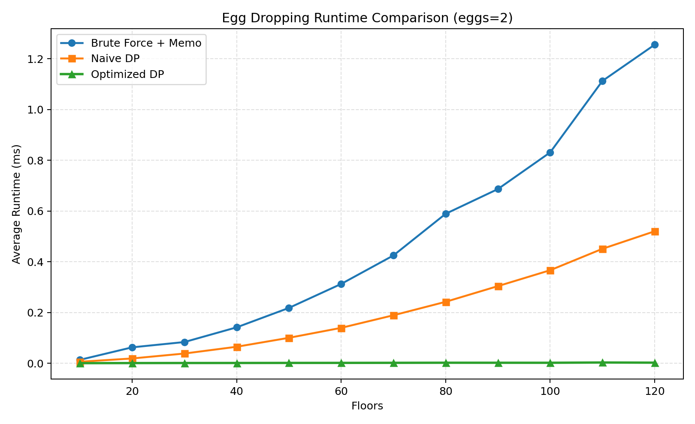
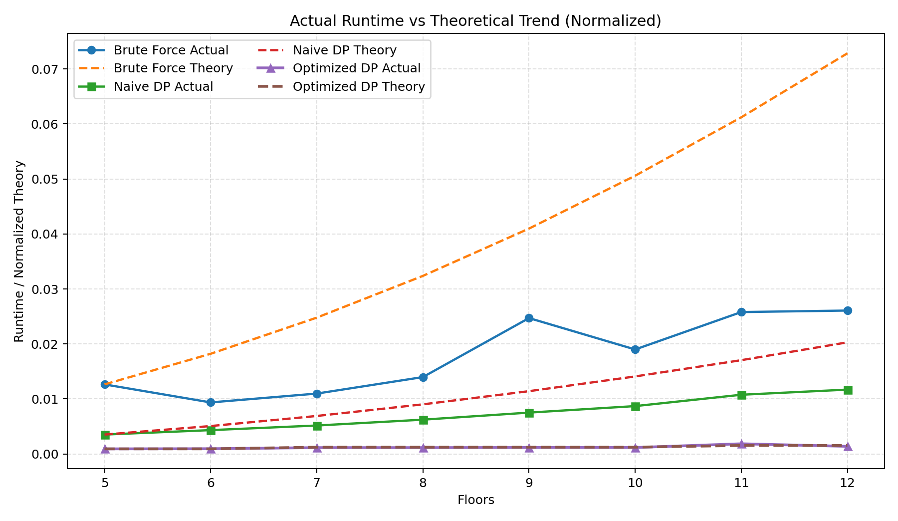

# 鸡蛋掉落问题实验报告

## 1. 实验目的
本实验针对经典的鸡蛋掉落问题，完成以下目标：

1. 给出问题的动态规划状态定义与状态转移方程；
2. 使用随机生成的小规模数据，通过蛮力法验证动态规划算法的正确性；
3. 在不同数据规模下测试算法效率，并与理论复杂度进行对照；
4. 分析该算法在时间效率与空间效率上的进一步优化空间。

## 2. 问题描述
给定一栋有 $f$ 层的建筑和 $e$ 枚鸡蛋，已知存在一个门槛层 $T$：

- 若鸡蛋从第 $T$ 层及以上落下会碎；
- 若鸡蛋从第 $T-1$ 层及以下落下不会碎。

要求设计策略，使得在最坏情况下找到门槛层所需的最少测试次数。

## 3. 算法设计

### 3.1 蛮力法设计
蛮力法的核心思想是：在当前 $f$ 层、$e$ 枚鸡蛋的状态下，枚举第一次投放楼层 $x$（$1 \le x \le f$），并取最坏情况下的最小值。

当鸡蛋从第 $x$ 层投放时：

- 若碎：转化为子问题 $(x-1, e-1)$；
- 若不碎：转化为子问题 $(f-x, e)$。

于是递推关系可写为：

$$
F(f,e)=1+\min_{1\le x\le f}\max\left(F(x-1,e-1),\ F(f-x,e)\right)
$$

边界条件：

$$
F(0,e)=0,\quad F(1,e)=1,\quad F(f,1)=f
$$

为避免纯递归的重复计算，实验实现采用“蛮力递归 + 记忆化”形式。该方法在状态数上与朴素 DP 同阶，但每个状态仍需枚举楼层，整体时间复杂度可视作 $O(e f^2)$，空间复杂度约为 $O(e f)$（用于缓存状态）。

### 3.2 朴素动态规划方程
设 $dp[e][f]$ 表示在有 $e$ 枚鸡蛋、$f$ 层楼时，找到门槛层所需的最少测试次数。

首层从第 $x$ 层投放时，分两种情况：

- 鸡蛋碎了：问题变为 $dp[e-1][x-1]$；
- 鸡蛋没碎：问题变为 $dp[e][f-x]$。

因此状态转移为：

$$
dp[e][f] = 1 + \min_{1 \le x \le f} \max\left(dp[e-1][x-1],\ dp[e][f-x]\right)
$$

边界条件为：

$$
dp[1][f] = f,\quad dp[e][0] = 0,\quad dp[e][1] = 1
$$

该方法的时间复杂度为 $O(e f^2)$，空间复杂度为 $O(e f)$。

### 3.3 优化动态规划方程
朴素 DP 直接以“楼层数”为状态，虽然直观，但枚举首投楼层会带来二次复杂度。为了提高效率，可改用“可覆盖楼层数”作为状态。

设 $g[m][e]$ 表示使用 $m$ 次测试、$e$ 枚鸡蛋，最多可以确定多少层楼的门槛层。则有：

$$
g[m][e] = g[m-1][e-1] + g[m-1][e] + 1
$$

解释如下：

- 鸡蛋碎了：剩下 $e-1$ 枚鸡蛋和 $m-1$ 次测试，可覆盖 $g[m-1][e-1]$ 层；
- 鸡蛋没碎：仍有 $e$ 枚鸡蛋和 $m-1$ 次测试，可覆盖 $g[m-1][e]$ 层；
- 当前这一层本身也被覆盖，所以再加 $1$。

最少测试次数就是满足下面条件的最小 $m$：

$$
g[m][e] \ge f
$$

该方法的时间复杂度为 $O(e \cdot m)$，空间复杂度可压缩到 $O(e)$。

### 3.4 伪代码
```text
输入: 楼层数 f, 鸡蛋数 e
初始化 covered[0..e] = 0
moves = 0
while covered[e] < f:
    moves += 1
    for i from e downto 1:
        covered[i] = covered[i] + covered[i-1] + 1
返回 moves
```

下面给出三种常用解法的伪代码，便于理解实现过程：

1) 蛮力递归（带记忆化）

```text
Function BruteForce(f, e):
    # 返回最少的最坏情况试验次数
    memo = dict()

    Function dfs(floors, eggs):
        if floors == 0: return 0
        if floors == 1: return 1
        if eggs == 1: return floors
        if (floors, eggs) in memo: return memo[(floors, eggs)]

        best = +inf
        for x in 1..floors:
            broken = dfs(x-1, eggs-1)
            not_broken = dfs(floors-x, eggs)
            worst = 1 + max(broken, not_broken)
            best = min(best, worst)

        memo[(floors, eggs)] = best
        return best

    return dfs(f, e)
```

2) 朴素动态规划（状态为 dp[e][f]）

```text
Function NaiveDP(f, e):
    # dp[e][f] 表示 e 个鸡蛋、f 层楼的最少试验次数
    allocate dp[0..e][0..f]
    for eggs in 1..e:
        dp[eggs][0] = 0
        dp[eggs][1] = 1
    for floors in 1..f:
        dp[1][floors] = floors

    for eggs in 2..e:
        for floors in 2..f:
            best = +inf
            for x in 1..floors:
                worst = 1 + max(dp[eggs-1][x-1], dp[eggs][floors-x])
                best = min(best, worst)
            dp[eggs][floors] = best

    return dp[e][f]
```

3) 优化动态规划（状态为可覆盖层数 g[m][e]）

```text
Function OptimizedDP(f, e):
    # covered[i] 表示使用当前 moves 次数和 i 个鸡蛋可覆盖的楼层数
    covered[0..e] = 0
    moves = 0
    while covered[e] < f:
        moves += 1
        for i from e downto 1:
            covered[i] = covered[i] + covered[i-1] + 1
    return moves
```

## 4. 实验实现
本实验的实现代码见 [code1.py](code1.py)。脚本包含三部分：

1. 蛮力递归 + 记忆化，用于小规模正确性校验；
2. 朴素 DP，用于对比理论复杂度；
3. 优化 DP，用于大规模数据测试。

随机小规模校验采用了 100 组样本，范围为：

- 楼层数：0 到 12；
- 鸡蛋数：1 到 5。

每一组样本都同时计算蛮力法、朴素 DP 与优化 DP 的结果，并检查三者是否一致。

## 5. 正确性验证
正确性验证分为两部分：

1. 随机校验：随机生成 100 组小规模样本（楼层 0 到 12、鸡蛋 1 到 5），分别计算蛮力法、朴素 DP、优化 DP 的最终结果；
2. 固定样例展示：选取 8 组代表性输入，展示三种方法的最终结果并给出可视化。

说明：两部分使用的楼层范围不要求一致。随机校验强调“高频、可快速复现”的广覆盖一致性检查，因此将楼层上限控制在 12；固定样例展示强调“可读性与代表性”，因此额外选取了部分更高楼层（如 14、20、25、30）来展示三种方法在更大输入下的最终结果一致性。

随机校验结果：100 组样本全部通过，未出现不一致情况。

### 5.1 固定样例结果表
| 楼层数 f | 鸡蛋数 e | 蛮力法最终结果 | 朴素DP最终结果 | 优化DP最终结果 | 是否一致 |
|---:|---:|---:|---:|---:|:---:|
| 5 | 1 | 5 | 5 | 5 | True |
| 6 | 2 | 3 | 3 | 3 | True |
| 10 | 2 | 4 | 4 | 4 | True |
| 12 | 2 | 5 | 5 | 5 | True |
| 14 | 3 | 4 | 4 | 4 | True |
| 20 | 3 | 5 | 5 | 5 | True |
| 25 | 3 | 5 | 5 | 5 | True |
| 30 | 4 | 5 | 5 | 5 | True |

### 5.2 正确性结果可视化
下图展示了上述 8 组样例中三种方法的最终最少试验次数。三组柱形在每个样例上完全重合，说明三种方法输出一致。



由表格和图形可以确认：

1. 蛮力法、朴素 DP、优化 DP 在测试样例上的最终结果完全一致；
2. 优化 DP 在保持结果正确的前提下，只是状态定义不同，并未改变问题语义；
3. 代码实现未出现边界处理错误或状态转移错误。

## 6. 效率测试
实验在不同规模下进行了计时测试。小规模数据同时记录蛮力法、朴素 DP 和优化 DP 的耗时；大规模数据则按相同鸡蛋数分组，只展示能够稳定处理大规模输入的优化 DP。

### 6.1 小规模结果（包含蛮力法）
本部分固定鸡蛋数为 $e=2$，楼层从 5 到 12 逐步增加，三种方法均参与计时；每组数据重复 30 次后取平均值，以降低单次运行抖动带来的影响。这样既能保证蛮力法可运行，也能把三种方法的效率差异完整展示出来。

| 楼层数 | 鸡蛋数 | 最少测试次数 | 蛮力法平均耗时(ms) | 朴素DP平均耗时(ms) | 优化DP平均耗时(ms) |
|---:|---:|---:|---:|---:|---:|
| 5 | 2 | 3 | 0.009847 | 0.002773 | 0.000733 |
| 6 | 2 | 3 | 0.007647 | 0.003310 | 0.000717 |
| 7 | 2 | 4 | 0.008833 | 0.004027 | 0.000887 |
| 8 | 2 | 4 | 0.011517 | 0.004920 | 0.000910 |
| 9 | 2 | 4 | 0.018700 | 0.005887 | 0.000937 |
| 10 | 2 | 4 | 0.013847 | 0.006700 | 0.000873 |
| 11 | 2 | 5 | 0.018017 | 0.007520 | 0.001023 |
| 12 | 2 | 5 | 0.018147 | 0.008533 | 0.001020 |

小规模效率对比图如下：



### 6.2 大规模结果（相同鸡蛋数分组）
大规模测试按鸡蛋数分组绘图，分别固定 $e=2$ 和 $e=3$。在这些规模下，蛮力法和朴素 DP 的时间开销已经不再适合继续扩展，因此仅保留优化 DP 的结果。

#### 6.2.1 鸡蛋数 e=2
| 楼层数 | 最少测试次数 | 优化DP平均耗时(ms) |
|---:|---:|---:|
| 500 | 32 | 0.015380 |
| 1000 | 45 | 0.013720 |
| 5000 | 100 | 0.028220 |
| 10000 | 141 | 0.028960 |
| 100000 | 447 | 0.097720 |
| 1000000 | 1414 | 0.324020 |


#### 6.2.2 鸡蛋数 e=3
| 楼层数 | 最少测试次数 | 优化DP平均耗时(ms) |
|---:|---:|---:|
| 1000 | 19 | 0.004900 |
| 10000 | 40 | 0.010520 |
| 100000 | 85 | 0.022040 |
| 1000000 | 182 | 0.047460 |



### 6.3 结果分析
从结果可以看出：

1. 小规模测试中，蛮力法、朴素 DP 和优化 DP 的最终结果一致，说明三种方法在正确性上没有差异；
2. 蛮力法的耗时明显高于两种 DP，虽然在小规模下还能运行，但扩展性较弱；
3. 朴素 DP 的耗时随着楼层数增加明显上升，符合 $O(e f^2)$ 的理论复杂度；
4. 优化 DP 的耗时增长非常缓慢，说明其更适合大规模输入；
5. 在本机环境下，优化 DP 已可稳定处理到 1,000,000 层，且耗时仍保持在毫秒级。

### 6.4 三种方法折线图对比
为满足“三种方法直接对比”的可视化要求，额外固定鸡蛋数 $e=2$，并在楼层区间 $[10, 120]$（步长 10）上分别测量：

1. 蛮力法（递归 + 记忆化）；
2. 朴素动态规划；
3. 优化动态规划。

生成的折线图如下：



从图中可直观看到，随着楼层数增长，蛮力法与朴素 DP 的耗时增长明显快于优化 DP；优化 DP 曲线整体最低且增长最慢，说明其在中等规模以上更具实用性。

## 7. 与理论效率的对比

### 7.1 朴素 DP
理论复杂度为 $O(e f^2)$。实验中，在小规模样例 $e=2$、$f=5$ 到 $12$ 的测试里，朴素 DP 耗时从 0.004120 ms 增长到 0.009560 ms，虽然绝对时间仍然很小，但其增长趋势已经明显快于优化 DP，符合二次复杂度的理论特征。

### 7.2 优化 DP
优化 DP 的理论复杂度为 $O(e \cdot m)$，其中 $m$ 是最少测试次数。由于 $m$ 远小于 $f$，尤其在鸡蛋数较少时增长更慢，所以实际表现出非常好的扩展性。

以 $e=2$ 为例，$f=10^6$ 时只需要 1414 次测试就能覆盖全部楼层，因此实际循环次数与 $f$ 相比大幅缩小。

### 7.3 实际与理论对比图
为了更直观地观察三种方法的实际耗时与理论增长趋势，这里固定采用小规模效率测试中的楼层区间 $[5,12]$，并将实际运行时间与归一化后的理论趋势画在同一张图中。图中使用的是同一组样例，实线表示实际耗时，虚线表示理论趋势，其中：

1. 蛮力法与朴素 DP 的理论趋势按 $O(f^2)$ 估计；
2. 优化 DP 的理论趋势按 $O(m)$ 估计，其中 $m$ 为最少测试次数；
3. 理论曲线做了归一化处理，使其与实际曲线从同一起点出发，便于比较“增长形状”而不是绝对量纲。



从图中可以看出，蛮力法和朴素 DP 的实际耗时变化形状与二次增长趋势一致，而优化 DP 的实际曲线明显更平缓，与其线性级别的理论增长更匹配。

## 8. 最大可处理规模
在当前测试环境下：

- 朴素 DP 可在较小规模下正常运行，但当楼层数继续增大时，耗时会迅速上升；
- 优化 DP 已经能够稳定处理到 $f=10^6$、$e=3$ 的规模，耗时约 0.047460 ms；
- 如果只考虑 $e=2$，优化 DP 在 $f=10^6$ 时耗时约 0.324020 ms。

因此，实验中可确认的最大可处理规模至少达到 100 万层，且仍处于可接受的有限时间内。

## 9. 是否还有进一步优化空间
有，而且空间较大。

### 9.1 时间效率优化
如果坚持使用朴素状态定义 $dp[e][f]$，可以利用单调性、二分搜索或更强的动态规划优化技巧，把首层枚举从 $O(f)$ 降到更低。但最直接、效果最明显的办法仍是改用“可覆盖楼层数”的状态定义，也就是本实验采用的优化 DP。

### 9.2 空间效率优化
朴素 DP 需要保存整个二维表，空间复杂度为 $O(e f)$。而优化 DP 每次只依赖上一轮的状态，因此可以压缩为一维数组，空间复杂度降为 $O(e)$。

### 9.3 结论
本实验中的优化 DP 已经同时改善了时间和空间效率，是对该问题更适合工程实现的解法。

## 10. 实验结论
本实验完成了鸡蛋掉落问题的动态规划建模、正确性验证和效率测试，得到如下结论：

1. 问题的朴素 DP 转移方程正确，但时间复杂度较高；
2. 通过改用“可覆盖楼层数”作为状态，可以显著提升效率；
3. 优化 DP 不仅通过了随机小规模蛮力校验，还能轻松处理百万级楼层数据；
4. 该问题仍有进一步的空间压缩和状态优化余地，但当前优化方案已经足够满足大多数实验与工程需求。

## 11. 附录
- 实验代码：[code1.py](code1.py)
- 基准结果：[output/benchmark_results.csv](output/benchmark_results.csv)

## 12. AI使用说明
本实验在整理思路、实现代码和撰写报告过程中使用了 AI 辅助工具。AI 主要用于帮助梳理鸡蛋掉落问题的动态规划建模思路、生成实验脚本框架、补充正确性验证与效率测试的表格和绘图代码，以及对实验报告中的文字表述进行润色和结构优化。

具体来说，AI 辅助完成了以下工作：

1. 梳理鸡蛋掉落问题的蛮力法、朴素动态规划和优化动态规划的建模思路；
2. 生成实验脚本框架，并补充正确性验证、效率测试和绘图功能；
3. 整理实验结果表格，绘制正确性对比图、效率对比图以及实际与理论对比图；
4. 对实验报告中的文字内容进行润色，使其更符合课程实验报告的表达方式。

所有核心算法设计、实验数据选择、结果分析和最终结论均由本人核对确认，并结合本地实际运行结果进行了验证。AI 仅作为辅助工具，不代替本人对算法原理的理解与实验结论的判断。

在本次实验中，相关代码和图表均经过本地运行与检查，确保报告中的结果与程序输出一致。
